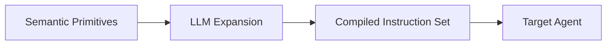

# QMS Agent Governance Framework
**A Behavioral Specification for AI Agents in Regulated Environments**

In high-consequence regulated industries, errors, unverified assumptions, or data alterations can directly impact safety, compliance, and product integrity.

Large Language Models (LLMs) are probabilistic systems capable of generating plausible but unsupported outputs and making assumptions from incomplete context. This open-source framework defines semantic primitives, workflow patterns, and semantic guardrails intended to constrain general-purpose AI agents toward controlled, source-driven operation.

Rather than just focusing on the final output, this framework defines the behavioral boundaries of the agent: what evidence it is permitted to use, when it must halt operations, and what actions are prohibited.

> **Core Philosophy:** This framework assumes the AI agent serves as a workflow assistant, not a decision-maker. It is intended to constrain the agent to administrative and knowledge-support activities while preserving human accountability for quality decisions and controlled records.

This framework is not intended to define:
* Autonomous quality decisions
* Batch disposition
* Laboratory result interpretation
* Release authorization
* Replacement of Quality Unit responsibilities
* Validated AI system requirements

---

## Why Semantic Primitives?
Some no-code AI agent builders impose limits on system instruction size. Even where explicit limits do not exist, longer instruction sets can become more difficult for models to consistently prioritize as they balance multiple instructions within their available context. Designing instruction sets that are concise, modular, and semantically rich can therefore be advantageous when building AI agents for QMS workflows.

Rather than writing monolithic, wordy prompts from scratch, this framework provides a standardized vocabulary of semantic primitives. A semantic primitive captures a governance behavior in a compact, reusable form that serves as a behavioral anchor during instruction design. When provided to an LLM alongside workflow-specific operational requirements, these primitives can be expanded into lean, context-efficient instruction sets without repeatedly encoding common governance behaviors.

---

## Design Philosophy: Workflow-Centric Architecture
When building agents for regulated environments, the intention is not to design prompts around abstract "AI Personas" acting autonomously. AI should not independently make quality decisions unless specifically validated, controlled, and approved for that intended use. 

Instead, designs follow Human Workflows. The semantic primitives and blueprints in this repository treat the AI agent as a collaborator that assists the user but is not responsible for quality decisions.

---

## The Compilation Pipeline

Rather than providing rigid, static system prompts, this framework operates as a compilation pipeline. You select semantic primitives, pass them to an LLM alongside your domain requirements, and let the LLM expand them into a complete instruction set tailored to your organization.

---

## Repository Structure

### [Semantic Primitives](./sp.md)
The primitive behavioral vocabulary. Compact semantic building blocks used as behavioral anchors during instruction drafting.

### [Blueprints (`blueprints/`)](./blueprints/)
The example blueprints demonstrate how an instruction set could be framed using the semantic primitives. Actual details and instruction generation would be made by the user and their choice of LLM.

---

## Disclaimer & Liability Notice
**Not Validated Software | Not Regulatory Advice**

This repository provides an experimental framework and conceptual architectural patterns for educational and developmental purposes only.
* **No Warranty:** The primitives and blueprints provided herein are offered "AS IS" without warranty of any kind, express or implied.
* **Not Validated:** This framework does not constitute validated software under requirements associated with 21 CFR Part 11, EU Annex 11, GAMP 5, or any other global regulatory standard.
* **User Responsibility:** The creators of this repository accept no responsibility for implementations, deployments, or outcomes resulting from the use of these primitives. It is the strict and sole responsibility of the implementing organization and its Quality Unit to independently verify, validate, and ensure that any AI system deployed in a regulated environment complies with all applicable internal procedures and international regulatory requirements.

---

## License
This framework is licensed under a [Creative Commons Attribution 4.0 International License](https://creativecommons.org/licenses/by/4.0/). You are free to share and adapt this material for any purpose, even commercially, provided you give appropriate credit to the original author. Attribution should reference this repository as the original source of the framework.
